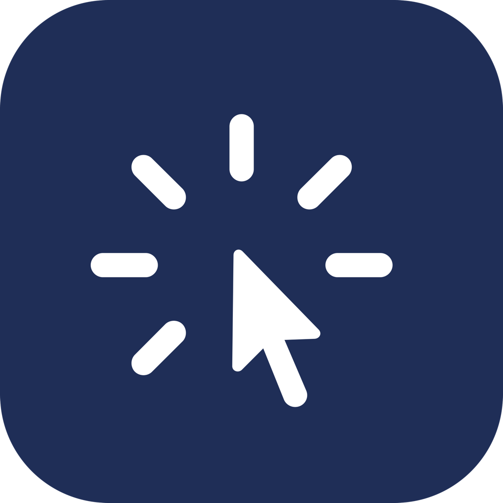

# Cursor Containment Field

A lightweight macOS menu bar utility that prevents the cursor from leaving the primary display. Designed for production and auditorium environments where operators work across multiple monitors and need the cursor reliably contained to the main presentation screen.

Forked from [mouselock](https://github.com/mxrlkn/mouselock) by mxrlkn. Rewritten as a menu bar-only app with a simplified containment model and auto-trigger functionality.

---

## Features

- **Menu bar toggle** — Enable or disable containment instantly from the menu bar icon. No Dock icon.
- **Auto-trigger** — Configure specific apps (e.g. ProPresenter, Resolume) to automatically enable containment when they launch and disable it when they quit.
- **Multi-display aware** — Blocks the cursor from escaping to displays positioned to the left, right, below, or above the primary display.
- **Menu bar stays accessible** — The menu bar strip is always free so the operator can reach the icon and toggle the app at any time.
- **Always starts disabled** — Containment is off on every launch. It only enables manually or when a configured trigger app is running.

---

## Requirements

- **macOS 13.0 or later** (Ventura+) — required for the SwiftUI `MenuBarExtra` API
- **Xcode** — required to build from source

No special system permissions are required.

---

## Building

```bash
xcodebuild \
  -project CursorContainmentField.xcodeproj \
  -scheme CursorContainmentField \
  -configuration Release \
  -derivedDataPath build/DerivedData \
  build
```

Copy to Applications and clear the Gatekeeper quarantine flag:

```bash
rm -rf /Applications/CursorContainmentField.app
cp -R build/DerivedData/Build/Products/Release/CursorContainmentField.app /Applications/
xattr -cr /Applications/CursorContainmentField.app
```

The app is ad-hoc signed (not notarized). The `xattr -cr` step is required on every install to allow macOS to open it without a Developer ID certificate.

---

## Usage

### Menu bar

Click the cursor icon in the menu bar to open the menu:

| Icon | State |
|------|-------|
| Cursor with rays | Containment **on** — cursor is locked to the primary display |
| Plain cursor | Containment **off** — cursor moves freely |

Menu options:
- **Enable / Disable Containment** — manual toggle
- **Settings...** — configure auto-trigger apps
- **Quit** — exit the app

### Auto-trigger apps

Open Settings from the menu to configure apps that should automatically enable containment.

- **Running Apps...** — pick from apps currently running that are installed in `/Applications`
- **From Disk...** — browse for any `.app` not currently running

When any configured app launches, containment enables. When all configured apps have quit, containment disables. The manual toggle always works regardless of auto-trigger state.

---

## Constraints and Known Limitations

**Polling-based containment** — The cursor position is checked at 60 fps. At very high cursor speeds, the cursor may briefly escape the screen edge for one or two frames before being snapped back. This is generally imperceptible in normal use.

**Menu bar zone is intentionally free** — The menu bar strip at the top of the screen is excluded from containment so the operator can always reach the menu bar icon. When a display is attached above the primary, the cursor is snapped back into the menu bar strip rather than being allowed to escape upward.

**Primary display only** — Containment is based on `NSScreen.main` (the display with the menu bar). In multi-display setups, the cursor is prevented from leaving the bounds of that display.

**Not notarized** — The app is signed ad-hoc. It cannot be distributed through the Mac App Store and will require quarantine removal (`xattr -cr`) on each installation. A Developer ID certificate and notarization would be required for wider distribution.

**macOS 26 beta note** — `NSStatusItem` is non-functional on Darwin 25.x. This app uses `MenuBarExtra` instead and has been tested on macOS 26 beta.

---

## Project Structure

```
CursorContainmentField/
├── CursorContainmentField.xcodeproj/
├── src/
│   ├── CursorContainmentFieldApp.swift   # App entry, AppState, AppDelegate, containment timer
│   ├── ContentView.swift                  # Menu bar view, settings window, running apps sheet
│   ├── Media.xcassets/                    # App icon assets
│   └── CursorContainmentField.entitlements
├── docs/
│   └── icon.png                           # App icon (used in this README)
├── license
└── README.md
```

---

## License

MIT License. Copyright © 2022 mxrlkn, © 2026 Austin Janey. See `license` for details.
